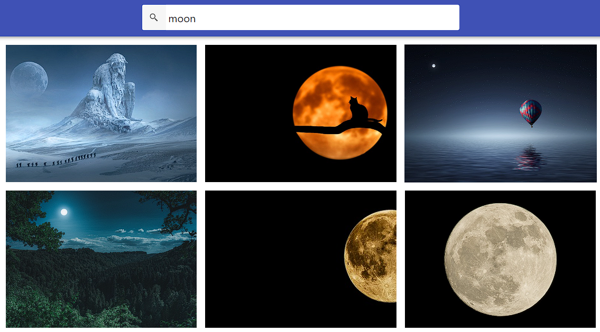
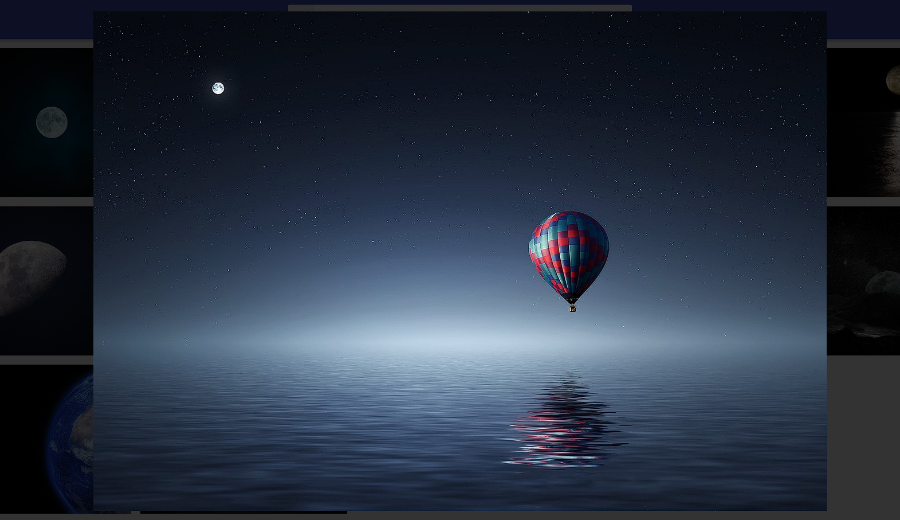

# Image Search React - project

- This is is a dynamic web application built using React, Axios, JavaScript, and CSS. It allows users to seamlessly search and explore images. The application renders real-time search results and enables users to view enlarged versions of selected images through an interactive modal.

## Table of Contents

- [General Info](#general-information)
- [Technologies Used](#technologies-used)
- [Project Features](#project-features)
- [Project Objectives](#project-objectives)
- [Setup](#setup)

## General Information

- This project is a simple app created to expand knowledge and gain
  experience in programming.

## Technologies Used:

- React
- CSS
- JavaScript
- Axios

## Project Features:

- Image Search:
  - Users can input a keyword related to the desired images.
  - Axios is used for communicating with an external API to dynamically fetch search results allowing users to preview images instantly.
    
- Modal with Enlarged Image:
  - Clicking on a selected image triggers an interactive modal displaying an enlarged version.
    
- Responsive Design:
  - Leveraging React and flexible CSS styling, the application's interface is responsive and adapts to various devices.

## Project Objectives:

- Skill Development:
  - Gaining proficiency in utilizing the React library for building a dynamic interface.
- API Interaction Experience:
  - Gain practical experience in using APIs to retrieve data.
- Enhancing User Experiences:
  - Implementing an interactive modal to enhance the image viewing experience.
  - Creating a responsive design for comfortable usage across different devices.

## Setup

To run this project, install it locally using npm:

```
npm i
npm start
```
