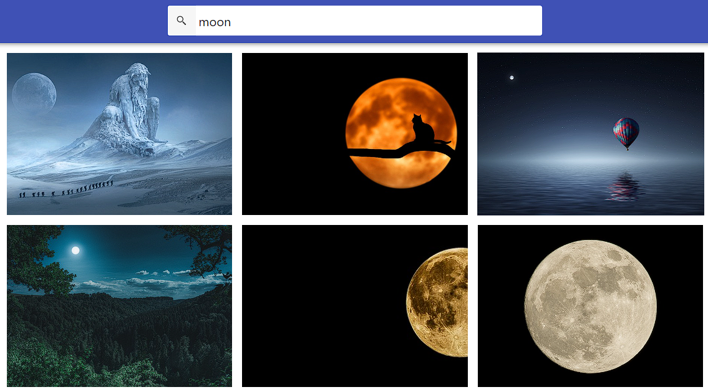
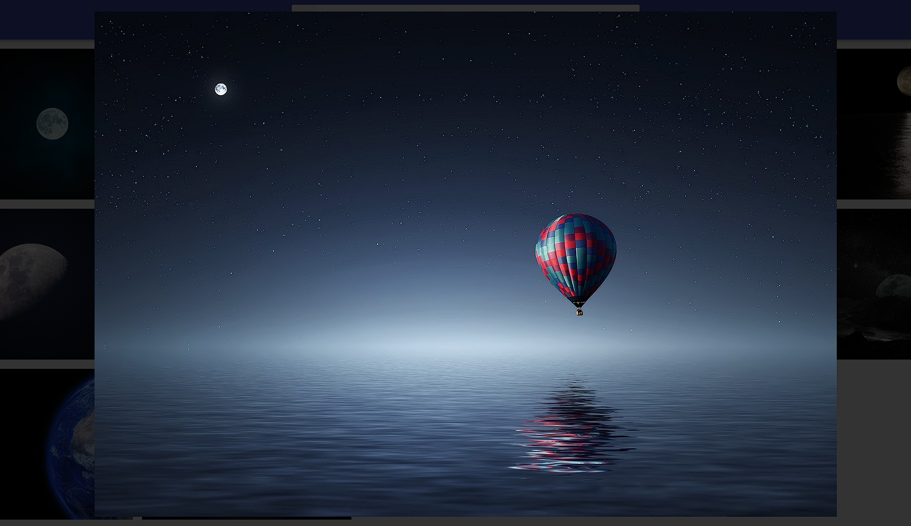

# Image Search React - project

- A React-based Single Page Application (SPA) for searching and browsing images using keywords. The data is fetched asynchronously from an external API.
- Live version [_here_](https://pawelwiteckiwawrzyniak.github.io/image-search-react-project/).

## Technologies Used:

- React
- CSS
- JavaScript
- Axios

## Key Features
* **Responsive Layout:** The user interface adapts to both mobile and desktop screens.
* **Image Search:** Integration with an external REST API using Axios to fetch and render images based on user input.
  
* **Image Preview (Modal):** A custom modal window component allowing users to view the selected image in full size.
   

